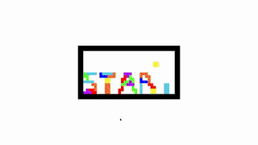

# SFMLtetris

*work in progress as of Monday, January 20, 2025, 22:16:14*

> an SFML tetris clone



### Resources

***Art***

> all art done by me, drawn by hand in aseprite

> note that the color pallets I used to color some of the blocks are credited in src/main.cpp

***Sounds/SFX***

> all sfx done by me in SFXR

### Controls
| keyboard button | action |
| --- | --- |
| q | quit |
| LEFT | move current block left |
| RIGHT | move current block right |
| DOWN | move current block down |
| UP | rotate current block in clockwise direction |
| z | rotate current block in counter clockwise direction |
| c | save current block into save buffer |
| SPACE | slam current block down and place |

### Features?
#### T-spin


#### Hidden grace-area


#### Color schemes


# INSTALLATION

## Linux

Dependencies:

> make >= 4.4.1

> libsfml >= 2.6.1

> clang++
>  
> (provided Makefile uses clang++. You can probably edit the makefile if wanted)

### My distro's repos *DON'T* have SFML:

1. clone the git repo and cd into it
```shell
git clone https://github.com/AmberGraph41161/SFMLtetris && cd SFMLtetris
```

2. make a build directory and cd into it
```shell
mkdir build && cd build
```

3. run cmake (this *should* automatically download SFML for you)
```shell
cmake ..
```

4. run cmake-generated makefile
```shell
make
```

5. move new binary to parent folder to resolve resource finding (binary and "resources/" must be in the same directory)
```shell
mv SFMLtetris ../ && cd ..
```

6. run and play SFMLtetris!
```shell
./SFMLtetris
```

### My distro's repos *DO* have SFML:

1. if your distro's repos have SFML, install SFML dependency with package manger.
on arch linux (and any other arch-based distro), do:
```shell
sudo pacman -S sfml
```

2. clone the git repo and cd into it
```shell
git clone https://github.com/AmberGraph41161/SFMLtetris && cd SFMLtetris
```

3. run the provided makefile
```shell
make
```

4. run the output binary and enjoy SFMLtetris!
```shell
./main
```

## Windows

> If you are not using MinGW, you're on your own. Good luck

Prerequisites:

- Software needed:
    - MinGW (g++/gcc, mingw32-make)
        - Either [MinGW-sourceforge](https://sourceforge.net/projects/mingw/) or [CodeBlocksIDE+MinGW-setup](https://www.codeblocks.org/downloads/binaries/)
    - [CMake](https://cmake.org/download/)
    - [git bash](https://git-scm.com/downloads)

1. open git bash terminal, clone the repository, and then cd into it
```shell
git clone https://github.com/AmberGraph41161/SFMLtetris && cd SFMLtetris
```

2. make build directory and cd into it
```shell
mkdir build && cd build
```

3. run the following CMake command to generate a makefile:
```shell
cmake -G "MinGW Makefiles" ..
```

4. run mingw32-make on the CMake generated makefile
```shell
mingw32-make
```

5. move new binary to parent folder
```shell
mv SFMLtetris.exe ..
```

6. copy necessary .dll files into same directory as SFMLtetris binary
```shell
cp _deps/sfml-build/lib/* ../
cp _deps/sfml-src/extlibs/bin/x86/openal32.dll ../
```

7. finally, cd into parent directory, run SFMLtetris, and enjoy!
```shell
cd .. && ./SFMLtetris.exe
```

## MacOS (OS X)
not tested as of Saturday, November 23, 2024, 01:29:39

# Please view only

This project is available for **viewing only**.
You are welcome to read and explore the source code, but **you may not copy, modify, or distribute** the code under any circumstances.
All rights are reserved to the original author.

For any requests regarding usage, please contact the author directly.
